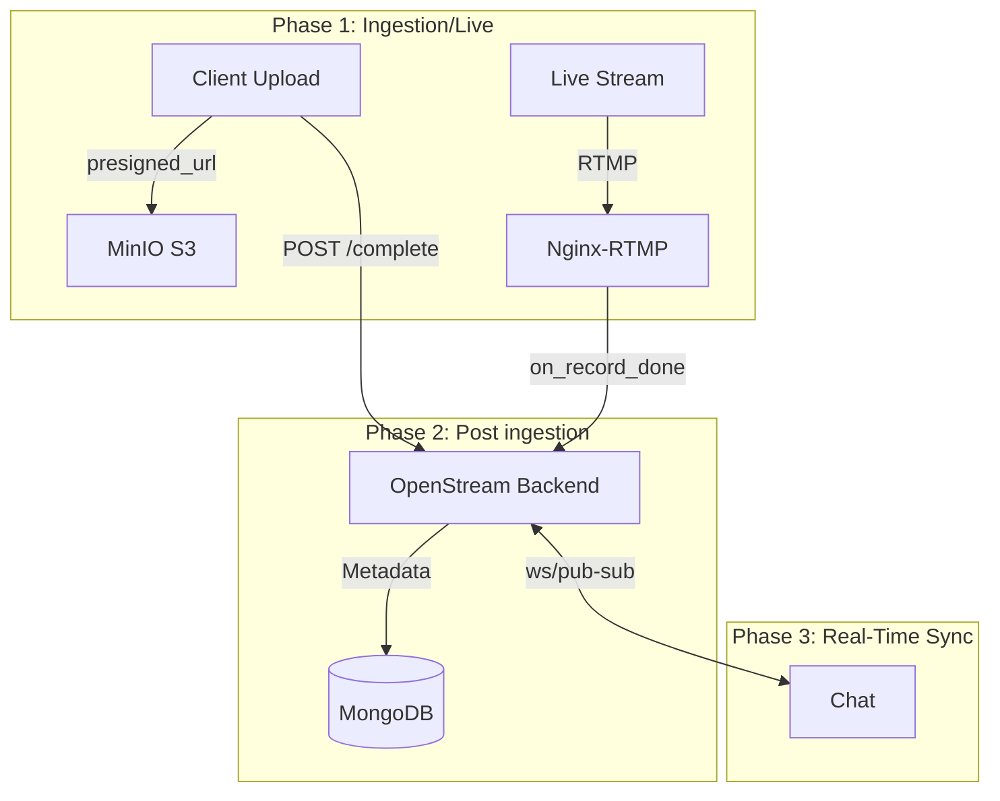

# OpenStream // BACKEND

**Status:** `OPERATIONAL` // **Tier:** `APPLICATION_SPOKE` // **Platform:** `OCTANEBREW_HUB`

**OpenStream Backend** is a high-fidelity live streaming control plane built with NestJS. It operates as a critical "spoke" in the OctaneBrew ecosystem, managing the orchestration of live video ingestion, real-time engagement, and asynchronous media archival.

---

## System Architecture

The service operates in a **Reactive Orchestration Mode**, coordinating between high-speed ingestion and shared platform intelligence.

1.  **Ingestion Authorization**: 
    *   Mediates between the `nginx-gateway` and `rtmp-ingest` nodes.
    *   Handles `on_publish` RTMP webhooks to validate enterprise-tier stream keys.
2.  **Real-Time Engagement**:
    *   Powers the persistent Chat Engine via **WebSockets (Socket.IO)**.
3.  **Autonomous Archival**:
    *   When recording concludes, it emits a `video.transcode` event to the shared **FFmpeg Worker** mesh.
    *   Polls for thumbnail generation and VOD state resolution via shared MinIO buckets.

### A. Unified Ingestion & Processing Pipeline


---

## 📂 Directory Structure

```text
.
├── src/
│   ├── auth/          # JWT & Platform Authentication
│   ├── chat/          # WebSocket
│   ├── stream/        # RTMP Webhooks & Authorization
│   ├── vod/           # Archival & Media Management
│   ├── main.ts        # Entry point & Swagger Init
│   └── app.module.ts  # Central Dependency Hub
├── test/              # E2E & Unit Test Suites
├── docker-compose.yml # Local Dev Infrastructure
└── package.json       # Dependencies & Scripts
```

---

## Tech Stack

*   **Runtime**: Node.js v22 (NestJS Framework)
*   **Database**: MongoDB (Mongoose) for low-latency session and VOD metadata.
*   **Messaging**: Kafka (via `@nestjs/microservices`) for distributed event sync.
*   **Real-time**: Socket.IO for duplex communication.
*   **Infrastructure**: Docker, Nginx (Reverse Proxy), MinIO (via Shared Hub).

---

## API & Documentation

*   **REST API**: Exposed at `https://openstream.octanebrew.dev/api/`
*   **Swagger Docs**: Interactive documentation is available at **[https://openstream.octanebrew.dev/api/docs](https://openstream.octanebrew.dev/api/docs)** (Production) or `/api/docs` (Local).

---

## Resilience & Reliability

*   **Distributed Tracing**: Support for **OpenTelemetry** to trace requests from the gateway down to the data layer.

---

## Deployment & CI/CD

This repository utilizes the **Standardized OctaneBrew SSH-Deploy Pipeline**.

*   **Workflow**: `.github/workflows/deploy.yml`
*   **Trigger**: Merges to `main`.
*   **Action**: Automates Docker builds and container updates on the remote enterprise core via SSH.

### Local Development
```bash
# Install dependencies
npm install

# Build the application
npm run build

# Start in development mode
npm run start:dev
```

---

## Security

*   **JWT Authorization**: All client-facing APIs require a valid platform-issued bearer token.
*   **Service Authentication**: Internal communication with the Hub is protected via the platform-wide `SERVICE_API_KEY`.
*   **Noir-Shield**: Protected by the global `nginx-gateway` which filters for Cloudflare IP ranges and enforces H2 protocols.
