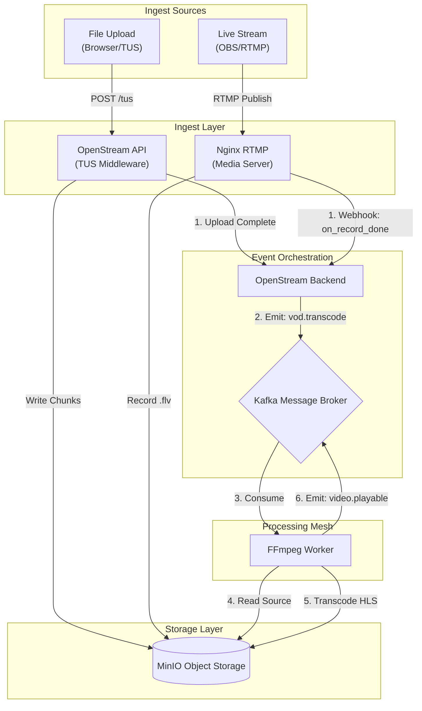
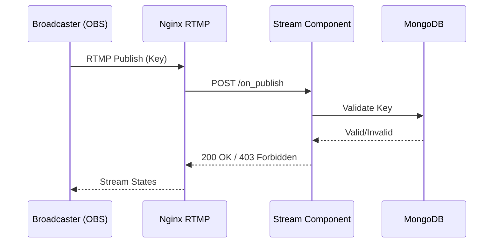
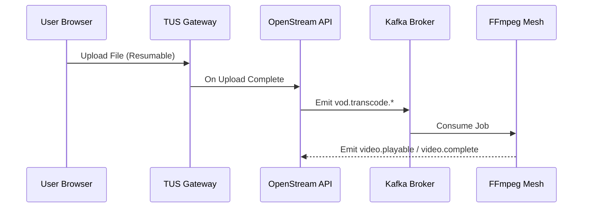

# System Architecture

## High-Level Design

OpenStream operates as a **Specialized Media Spoke** within the **OctaneBrew Platform**. It is designed to be the high-performance engine responsible for all video ingestion, processing, and real-time delivery tasks.

### The Spoke Architecture
The OctaneBrew ecosystem follows a Hub-and-Spoke model where specialized applications handle distinct domains:

*   **OctaneBrew Hub**: Central platform orchestration.
*   **Conduit Spoke**: Content Management System (CMS) and editorial workflows.
*   **OpenStream Spoke**: Real-time media ingestion, transcoding, and delivery.

This separation of concerns allows OpenStream to scale independently based on ingest load, without impacting the CMS or other platform services. It communicates asynchronously with the rest of the mesh via Kafka for heavy workloads (like VOD processing) and synchronous APIs for immediate state verification.

---

## Unified Media Flow

OpenStream unifies **Live Streaming** and **VOD Uploads** into a single processing pipeline. Whether video comes from OBS or a file upload, it ends up in the same FFmpeg Worker Mesh.

---

## Core Modules

### 1. Stream Component (Live Ingestion)
The neural center for live broadcasting. It bridges the gap between the raw RTMP ingest layer and the application logic.

*   **Ingest Controller**: Manages the handshake with the `nginx-rtmp` media server.
    *   **Auth Webhook (`/streams/on_publish`)**: Intercepts the RTMP `on_publish` event. It extracts the Stream Key (`sk_live_...`), validates it against the database, and authorizes the session.
    *   **Recording Hook (`/streams/on_record_done`)**: Triggered when a broadcast ends. It receives the path to the recorded FLV file and dispatches a job to the **Media Processing Mesh**.
*   **Key Management**: Secure generation and rotation of Stream Keys. Keys are cryptographically random and linked to the User ID.

### 2. VOD Pipeline (Smart Uploads)
A resilient, event-driven system for handling video uploads.

*   **TUS Middleware**: Implements the TUS resumbale upload protocol. Handles multi-GB file uploads over unstable networks.
*   **Split-Lane DAG**: A sophisticated processing graph that optimizes for both speed and quality.
    *   **Slow Lane**: Prioritizes "Quality-per-Bit". Uses complexity analysis to generate optimized 720p/1080p renditions.

### 3. Chat Engine (Real-Time)
A high-frequency ephemeral messaging system.

*   **Socket.IO Gateway**: Manages thousands of concurrent WebSocket connections.
*   **Room Architecture**: Each stream is a distinct "Room".
*   **Persistence**: Chat messages are persisted to MongoDB for VOD replay ("Chat Replay").

---

## Data Flow: The Media Lifecycle

1.  **Ingest**: Video enters via RTMP (Live) or TUS (Upload).
2.  **Processing**:
    *   **Live**: Transmuted to HLS by Nginx on the fly.
    *   **VOD**: Transcoded by the FFmpeg Worker Mesh (Kafka-driven).
3.  **Storage**: All media assets (HLS segments, m3u8 playlists, Thumbnails) are stored in **MinIO** (S3-compatible object storage).
4.  **Delivery**: Content is served via the `openstream-frontend` portal, proxied through the Nginx Gateway for caching and SSL termination.

---

## Microservices Interaction

OpenStream relies on a mesh of specialized services:

| Service | Role | Communication |
| :--- | :--- | :--- |
| **FFmpeg Worker** | Video Transcoding & Tuning | Kafka (`video.transcode.*`) |
| **MinIO** | Object Storage (Video/Image) | S3 Protocol / Local Mount |
| **MongoDB** | Metadata & State Persistence | TCP |
| **Redis** | Job Queues & Socket State | TCP |
