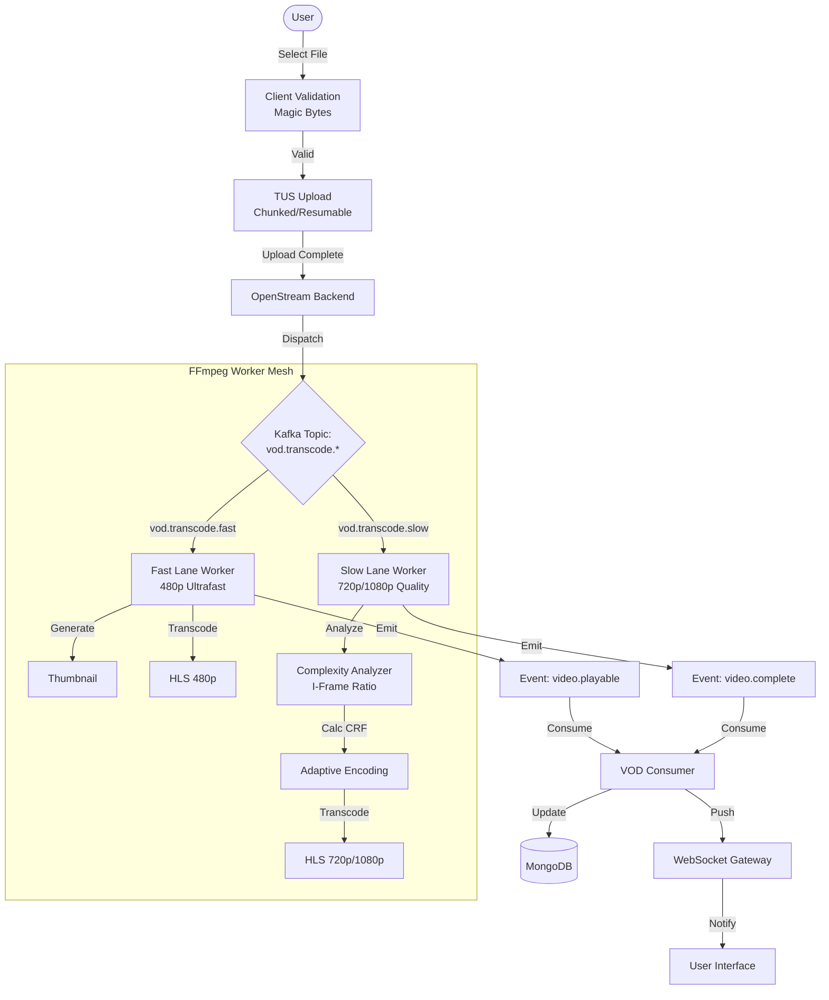
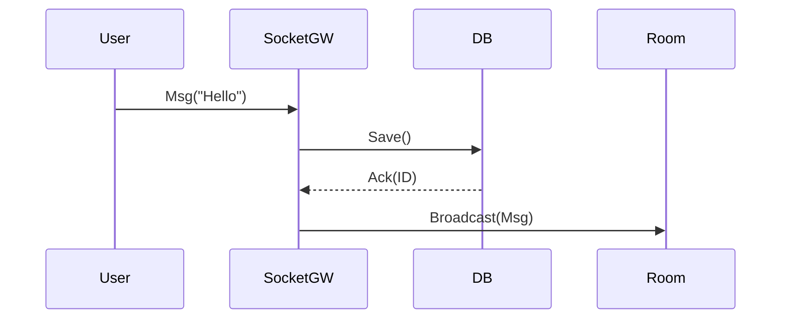

# Core Workflows

## 1. Smart Upload Pipeline (Split-Lane DAG)

This pipeline uses a **Directed Acyclic Graph (DAG)** to split video processing into two parallel lanes, balancing instant gratification with long-term quality.

### Pipeline Architecture

### Process Flow & Lanes

1.  **Fast Lane (`vod.transcode.fast`)**:
    *   **Goal**: "Time-to-Glass". Get the video playable as fast as possible.
    *   **Tech**: Uses `ultrafast` FFmpeg preset and a standardized CRF.
    *   **Result**: 480p HLS manifest + Thumbnail within ~30 seconds.

2.  **Slow Lane (`vod.transcode.slow`)**:
    *   **Goal**: "Quality-per-Bit". Optimize storage and visual fidelity.
    *   **Complexity Analysis**: Scans the first 30s of video to calculate the **I-Frame to P-Frame ratio**.
        *   High Motion (Gaming) = Lower CRF (High Bitrate).
        *   Low Motion (Talking Head) = Higher CRF (Low Bitrate).
    *   **Result**: Optimized 720p/1080p HLS renditions.

---

## 2. Live Streaming Handshake

The secure protocol for establishing a live broadcast.

1.  **Authentication**:
    *   User requests Stream Key from Dashboard.
    *   Key format: `sk_live_<uuid>`.

2.  **Connection**:
    *   Broadcaster (OBS/FFmpeg) connects to `rtmp://ingest.openstream.dev/live`.
    *   Nginx-RTMP initiates `on_publish` callback.

3.  **Validation**:
    *   Backend checks Key validity and User standing (Banned/Active).
    *   If invalid: Returns `403 Forbidden`, Nginx drops connection.
    *   If valid: Returns `200 OK`, stream begins.

4.  **Teardown**:
    *   Broadcaster disconnects.
    *   Nginx Nginx initiates `on_record_done`.
    *   Backend triggers "Live-to-VOD" archiving job.

---

## 3. Chat System Interaction

Persistence-first real-time messaging.

1.  **Connection**:
    *   Client connects to `wss://api.openstream.dev` with JWT.
    *   Socket handshake upgrades to WebSocket.

2.  **Room Join**:
    *   Client emits `join_room` with `channelId`.
    *   Server adds socket to the specific Redis interaction room.

3.  **Message Flow**:
    *   Client sends message.
    *   Server:
        1.  Validates payload/rate-limits.
        2.  Saves to MongoDB `ChatMessage` collection.
        3.  Broadcasts to room participants.

